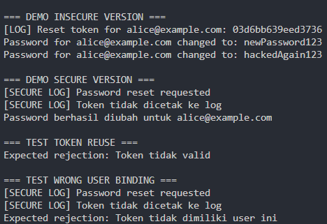

# Secure Password Reset Token

## Tentang Project

Project ini dibuat sebagai bagian dari praktikum **Pengkodean Aman (Secure Coding)** dengan studi kasus **Password Reset Token Leak**.

Melalui project ini, saya mempelajari bagaimana fitur reset password yang terlihat sederhana ternyata dapat menimbulkan risiko keamanan apabila tidak dirancang dengan baik.

Project ini membandingkan dua pendekatan:

* **Insecure Version** (implementasi yang rentan)
* **Secure Version** (implementasi dengan prinsip Secure by Design)

---

##Permasalahan pada Versi Insecure

Pada implementasi awal ditemukan beberapa kelemahan keamanan:

* Token disimpan dalam bentuk plaintext
* Token tercetak ke log aplikasi
* Token tidak memiliki masa berlaku (expiration)
* Token dapat digunakan berulang kali
* Token tidak terikat dengan pengguna tertentu

Akibatnya, token yang bocor dapat dimanfaatkan untuk mengambil alih akun pengguna.

---

##Perbaikan pada Versi Secure

Untuk mengatasi permasalahan tersebut, dilakukan beberapa perbaikan:

* Secure Random Token
* SHA-256 Token Hashing
* User Binding
* Expiry Invariant
* Read-Once Token
* Domain Primitive
* Misuse Prevention

Dengan pendekatan ini, token hanya dapat digunakan oleh pengguna yang berhak dan hanya dapat digunakan satu kali.

---

##Hasil Pengujian

### Token Reuse Test

Menguji apakah token yang sudah digunakan dapat dipakai kembali.

**Hasil:** Sistem berhasil menolak penggunaan ulang token.

### Wrong User Binding Test

Menguji apakah token milik pengguna lain dapat digunakan untuk melakukan reset password.

**Hasil:** Sistem berhasil menolak percobaan tersebut.

---

## Demo Output

> Tambahkan screenshot hasil eksekusi program pada folder `screenshots`.

### Output Program



---

##Teknologi yang Digunakan

* Python
* Dataclasses
* hashlib
* secrets
* datetime

---

##Insight yang Didapat

Dari praktikum ini saya memahami bahwa token bukan sekadar string biasa. Sebuah token memiliki:

* Lifecycle
* Ownership
* Expiry
* Consumption Rules

Penerapan prinsip **Secure by Design** membantu mengurangi risiko keamanan sejak tahap perancangan aplikasi, bukan setelah aplikasi selesai dibuat.

---

##Struktur Project

```text
secure-password-reset-token/
│
├── secure_password_reset.py
├── README.md
│
└── screenshots/
    └── demo-result.png
```

---

## Author

**Michael Lim**
Mahasiswa Informatika
Fakultas Teknologi Industri
Universitas Atma Jaya Yogyakarta

Mata Kuliah: **Pengkodean Aman (Secure Coding)**
